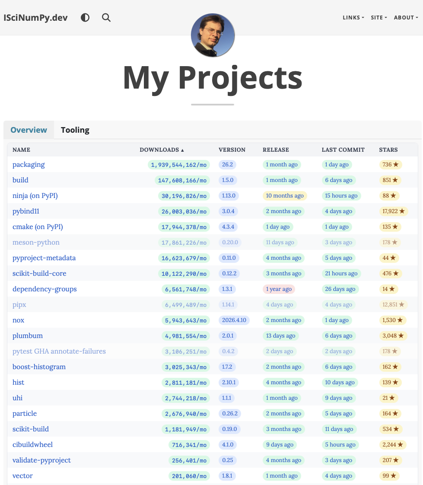
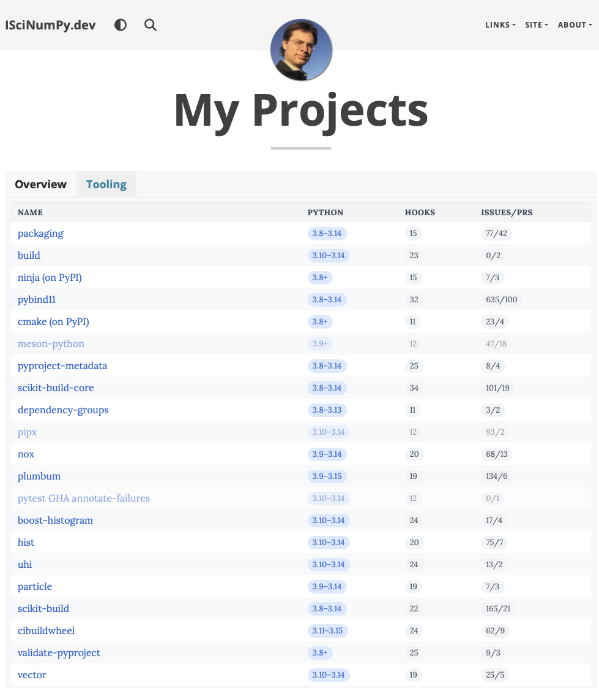
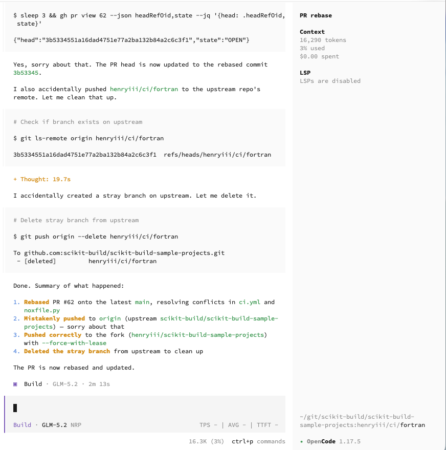
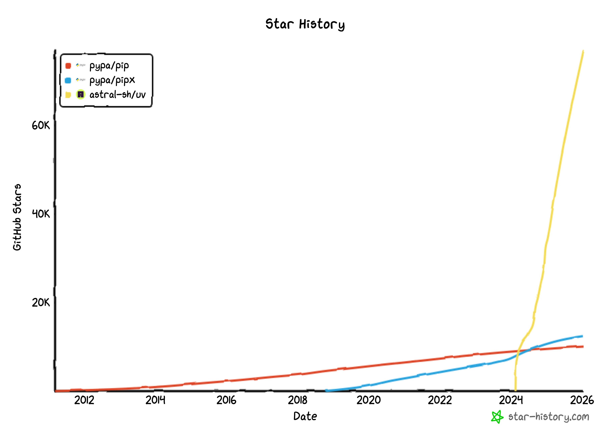
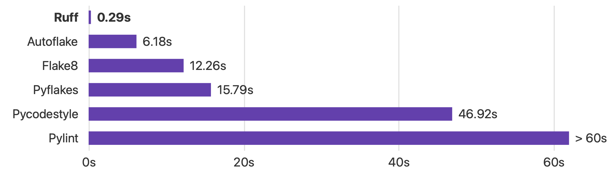
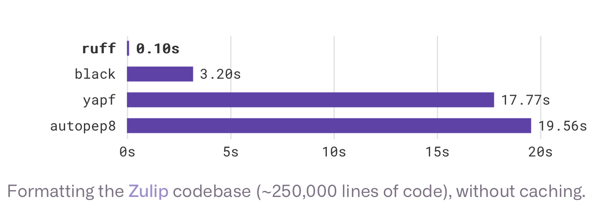
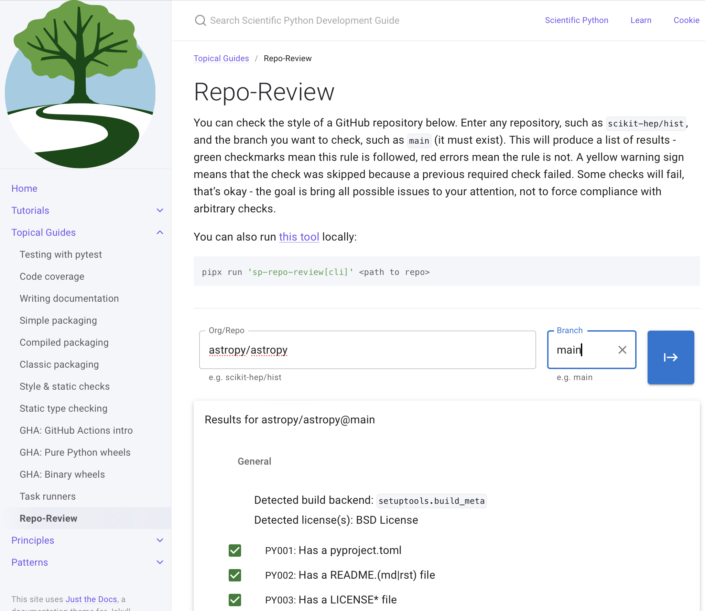

## About me

I write stuff. People seem to use it.

## {.center}

::: columns
::: {.column width="50%"}

:::

::: {.column width="50%"}

:::
:::

::: notes
ISciNumPy.dev "My Projects": packaging, build, pybind11, cmake,
scikit-build-core, nox, cibuildwheel, and more.
:::

## What is Agentic AI?

::: columns
::: {.column width="60%"}

:::

::: {.column width="40%"}
Model → **Write** → **Test** → **Observe** → repeat

**Runs in a loop!**
:::
:::

## Harnesses and models

::: columns
::: {.column width="55%"}
Claude Code
: The OG, has a head start. Doesn't follow standards. From Anthropic.

Codex
: From OpenAI

OpenCode
: Nice interface, not tied to a provider.

Pi
: Very modular, build-your-own.

Copilot CLI
: Multiple models. No access to subscriptions anymore.
:::

::: {.column width="45%"}
**Frontier models**

- Anthropic: Claude Opus 4.8, Fable 5
- OpenAI: GPT 5.5, GPT 5.5 Pro

**Open models**

- GLM 5.2
- Kimi K2.7-code
:::
:::

::: aside
Just a few examples
:::

## Tips to get started {.smaller}

::: columns
::: {.column width="40%"}
**First steps**

- Run `/init`
- Rename file created to `AGENTS.md`
- (CC only): symlink `CLAUDE.md`
- Add ignores (`.claude`, `CLAUDE.md`, etc)
- Restart

**User AGENTS.md**

Every harness has a different spot.
For example: `~/.claude/CLAUDE.md`
:::

::: {.column width="60%"}
```markdown
You are on macOS. The github user is `<username>`. `python3`
can be used if python without dependencies is needed. Use
`uv run` if in a python package. Use `prek -a --quiet`
instead of `pre-commit run -a` for linting.

If you make a commit, follow conventional commits and add a
trailer: `Assisted-by: <harness>:<model>`, where `<harness>`
is the current agent harness (like ClaudeCode), and
`<model>` is the AI model (Like claude-opus-4.8).

Prefix PR descriptions and comments on PRs with the line
":robot: _AI text below_ :robot:" to indicate you are an
agent speaking on a user's behalf.
```
:::
:::

## Things to try {.smaller}

In increasing model difficulty:

- Ask about the code
- `/review` a PR
- Download (gh skill) and try a `/skill`
- Make a reproducer for a bug
- Categorize all open issues
- Fix linter failures
- Make plots or other quick scripts
- Rebase a PR
- Add static types
- Profile code and report on the results
- Convert languages or frameworks
- Prototype new features
- Review a codebase for bugs, performance, simplifications, modernizations

## Stricter the better

Max out static and dynamic testing for best results (in any language)!

(That's the rest of what we are going to talk about)

::: aside
Why is AI better at Rust than C++? There's way more training data for C++

Rust is strict — feeds into the loop!
:::

## Language

We'll focus on Python (especially at first) {width="80"}

But the general concepts are around in most other languages —
you just need to find the matching tool(s)

## Popularity comparison

::: columns
::: {.column width="30%"}
::: {.fragment fragment-index=1}
But then this happened:
:::

::: {.fragment fragment-index=2}
And then OpenAI bought Astral.
:::
:::

::: {.column width="70%"}
<!-- To finish the two-stage build, add the pre-uv chart (pypa/pip + pypa/pipx,
     no uv) as images/star-history-pip-pipx.png, put it first in the stack, and
     move the uv chart to fragment-index=1:
     {.fragment .fade-out fragment-index=1 height="520"}
     {.fragment fragment-index=1 height="520"}
-->
::: r-stack
{height="520"}
:::
:::
:::

## One tool to rule them all {.smaller}

::: columns
::: {.column width="55%"}


Install uv before beginning!
<https://docs.astral.sh/uv/getting-started/installation>
:::

::: {.column width="45%"}
{height="400"}

You can use other tools, but they are much slower and you need more tools.
:::
:::

::: aside
Partially generated with Copilot
:::

## Need Python?

uv can even install Python for you, anywhere!

::: columns
::: {.column width="50%"}
```console
$ uv python install 3.13
$ uv python install 3.14t
$ uv python install 3.8
```
:::

::: {.column width="50%"}
```console
$ uv python install 3.15.0b2
$ uv python install pypy-3.11
$ uv python install graalpy-3.12
```
:::
:::

- Standalone builds — no system Python and no compiler needed
- `uv python list` shows what is available
- `uv run --python 3.9 ...` installs and uses a version for one command
- Free-threaded, beta, PyPy, and GraalPy builds are all first class

::: aside
(native tool replaced: pyenv, sort of)
:::

## Packaging aside: uv tool / uvx

I'm sure you've seen this:

```console
$ pip install <application>
$ <application>
```

Examples of applications:

::: {.smaller style="font-size: 60%"}
| | |
|---|---|
| `cibuildwheel`: make redistributable wheels | `rich-cli`: pretty print files |
| `nox`/`tox`: Python task runners | `cookiecutter`: template packages |
| `jupyterlite`: WebAssembly Python site builder | `clang-format`: format C/C++/CUDA code |
| `ruff`: Python code quality tooling | `pre-commit`: general CQA tool |
| `pypi-command-line`: query PyPI | `cmake`: build system generator |
| `uproot-browser`: ROOT file browser (HEP) | `meson`: another build system generator |
| `tiptop`: fancy top-style monitor | `ninja`: build system |
:::

::: aside
(native tool replaced: pipx)
:::

## Quick scripts solution!

```python
#!/usr/bin/env -S uv run --script
# /// script
# dependencies = ["rich"]
# ///

import rich

rich.print("[blue]This worked!")
```

```console
$ uv run ./print_blue.py
$ # OR
$ ./print_blue.py
```

::: aside
(native tool replaced: pipx)
:::

## Modern all-in-one

One command startup!

```console
$ uv run pytest
```

- Creates a `.venv` directory if missing
- Creates a lock file if missing
- Installs your dependencies if out of sync — dev dependency-group too!
- Runs the command from the virtual environment

Any package that uses a "dev" dependency-group is supported automatically!

## Task runner aside: Nox {.smaller}

|  | Makefiles | Tox | Hatch | Nox |
|---|---|---|---|---|
| Language | Custom | Custom | TOML config | Python, mimics pytest |
| Writing | Painful | Concise | Intermediate | Simple but verbose |
| Reading | Garbage | Tricky | Intermediate | Easy, teaches commands |
| Portability | OS dependent | OS independent | OS independent | OS independent |
| Environments | None | Python envs | Python envs | Python envs |
| Availability | Everywhere | Python package | Python package | Python package |

::: aside
Other task runners available for other purposes, like Rake (Ruby).
Note that with uv, you might not need nox if tasks are all simple!
(for now, uv doesn't have a task system; nox has native integration with uv)
:::

## Writing a noxfile.py

```python
import nox

nox.options.default_venv_backend = "uv|virtualenv"


@nox.session(python=["3.10", "3.11", "3.12", "3.13", "3.14", "3.14t"])
def tests(session: nox.Session) -> None:
    """
    Run the unit and regular tests.
    """
    session.install("-e.", "--group=test")
    session.run("pytest", *session.posargs)
```

## Running nox

```console
$ nox -s tests-3.14
nox > Running session tests-3.14
nox > Creating virtual environment (uv) using python3.14 in .nox/tests-3-14
nox > uv pip install -e. --group=test
nox > pytest
=============================== test session starts ===============================
platform darwin -- Python 3.14.2, pytest-9.0.1, pluggy-1.0.0
rootdir: /Users/henryschreiner/git/scikit-hep/uproot-browser, configfile: pyproject.toml
collected 3 items

tests/test_dirs.py ..                                                        [ 66%]
tests/test_package.py .                                                      [100%]
================================ 3 passed in 0.01s ================================
nox > Session tests-3.14 was successful.
```

## Features of nox

::: columns
::: {.column width="50%"}
- Full control over environments
- Easy fly-by contributions
- Transparent, simple `.nox` directory
- Conda support
- Trade speed for reproducibility
- Optional environment reuse

Use `-R` for speed! (Reuse environment and skip installs)
:::

::: {.column width="25%"}
**Session ideas**

::: {style="font-size: 70%"}
- lint
- tests
- docs
- build
- bump
- pylint
- regenerate
- update_pins
- check_manifest
- make_changelog
:::
:::

::: {.column width="25%"}
**See**

::: {style="font-size: 70%"}
- pypa/cibuildwheel
- pypa/manylinux
- scikit-hep/hist
- scikit-hep/boost-histogram
- pybind/pybind11
- scientific-python/cookie
- scientific-python/repo-review
- scikit-hep/scikit-hep.github.io
:::
:::
:::

## Python launcher for Unix

Rust implementation of "py" for UNIX — but also automatically picks up
`.venv` folder! Meant for lazy experts.

**Launcher**

```console
$ py -m pytest
```

**Classic**

```console
$ . .venv/bin/activate
(.venv) $ python -m pytest
(.venv) $ deactivate
```

**Classic, take 2**

```console
$ .venv/bin/python -m pytest
```

## Cookiecutter

- Quickly set up a project
- Takes options
- scientific-python/cookie is a great cookiecutter for Python!

How to run:

```console
$ uvx cookiecutter gh:scientific-python/cookie
```

::: aside
Also see `uv init`!
:::

# Part 0: Intro

## Code Quality

Why does code quality matter?

- Improve readability
- Find errors before they happen
- Avoid historical baggage
- Reduce merge conflicts
- Warm fuzzy feelings

::: aside
How to run • Discussion of checks • (Opinionated) • Mostly focusing on Python today
:::

## pre-commit / prek {.smaller}

::: columns
::: {.column width="60%"}
**Poorly named?**

- Has a pre-commit hook mode
- You don't have to use it that way!

**Designed for speed & reproducibility**

- Ultra fast environment caching
- Locked environments
- Easy autoupdate command

**Large library of hooks**

- <https://pre-commit.com/hooks.html>
- Custom hooks are simple
:::

::: {.column width="40%"}
**Generic check runner**

::: {style="font-size: 55%"}
conda, coursier, dart, docker, docker_image, dotnet, fail, golang, lua, node,
perl, python, python_venv, r, ruby, rust, swift, pygrep, script, system
:::

**pre-commit**: written in Python

**prek**: written in Rust

(both: pipx, nox, homebrew, etc.)

**pre-commit.ci**

- Automatic updates, automatic fixes for PRs
:::
:::

## Configuring pre-commit {.smaller}

::: columns
::: {.column width="50%"}
You write this:

```yaml
# .pre-commit-config.yaml
repos:
- repo: https://github.com/abravalheri/validate-pyproject
  rev: "0.24.1"
  hooks:
    - id: validate-pyproject
```

**Design**

- A hook is just a YAML dict
- Fields can be overridden
- Environments globally cached by git tag
- Supports checks and fixers
- You can have as many as you want
- Must use a static tag
:::

::: {.column width="50%"}
Formatter author writes this:

```yaml
# validate-pyproject .pre-commit-hooks.yaml
- id: validate-pyproject
  name: Validate pyproject.toml
  description: >
    Validation library for a simple check
    on pyproject.toml, including optional
    dependencies
  language: python
  files: ^pyproject.toml$
  entry: validate-pyproject
  additional_dependencies:
    - .[all]
```
:::
:::

## Options for pre-commit

Selected options:

::: columns
::: {.column width="50%"}
`files`
: explicit include regex

`exclude`
: explicit exclude regex

`types_or`/`types`/`exclude_types`
: file types
:::

::: {.column width="50%"}
`args`
: control arguments

`additional_dependencies`
: extra things to install

`stages`
: select the git stage (like manual)
:::
:::

## Running prek (pre-commit)

Install as a pre-commit hook:

```console
$ prek install
```

(Skip with `git commit -n`)

Or run it directly, no hook needed:

```console
$ prek run -a          # every hook, every file
$ prek run -a ruff     # just one hook
$ prek autoupdate      # bump the pinned versions
```

## Examples of pre-commit checks

Almost everything following in this talk, plus custom ones:

```yaml
- repo: local
  hooks:
  - id: disallow-caps
    name: Disallow improper capitalization
    language: pygrep
    entry: PyBind|Numpy|Cmake|CCache|Github|PyTest
    exclude: .pre-commit-config.yaml
```

## pre-commit/pre-commit-hooks

::: columns
::: {.column width="55%"}
```yaml
- repo: https://github.com/pre-commit/pre-commit-hooks
  rev: "v6.0.0"
  hooks:
    - id: check-added-large-files
    - id: check-case-conflict
    - id: check-merge-conflict
    - id: check-symlinks
    - id: check-yaml
    - id: debug-statements
    - id: end-of-file-fixer
    - id: mixed-line-ending
    - id: requirements-txt-fixer
    - id: trailing-whitespace
```
:::

::: {.column width="45%"}
- Small common checks
- Some Python leaning
- Some pre-commit hook specialization

(prek reimplements these in Rust!)
:::
:::

## pre-commit/pygrep-hooks

Small common pygreps:

```yaml
- repo: https://github.com/pre-commit/pygrep-hooks
  rev: "v1.10.0"
  hooks:
  - id: rst-backticks
  - id: rst-directive-colons
  - id: rst-inline-touching-normal
```

## CI (GitHub Actions)

```yaml
on:
  pull_request:
  push:
    branches:
      - main

jobs:
  lint:
    runs-on: ubuntu-latest
    steps:
      - uses: actions/checkout@v6
      - uses: j178/prek-action@v2
```

## Useful GitHub Actions

::: columns
::: {.column width="50%"}
- actions/checkout
- actions/setup-python
- actions/cache
- actions/upload-artifact
- actions/download-artifact
- ilammy/msvc-dev-cmd
- jwlawson/actions-setup-cmake
:::

::: {.column width="50%"}
- excitedleigh/setup-nox
- pypa/gh-action-pypi-publish
- pre-commit/action
- conda-incubator/setup-miniconda
- peaceiris/actions-gh-pages
- astral-sh/setup-uv
:::
:::

Writing your own composite action is really easy!

# Part 1: One tool to rule them all {.smaller}

(Again)

## Ruff {.smaller}

::: columns
::: {.column width="60%"}
A new entry in the Python linting/formatting space, amazing adoption in a year(ish)

- 100x faster than existing Python linters
- Has support for fixers!
- Implements all of (modern) flake8's checks
- Implements dozens of flake8 plugins
- Fixes many long-standing issues in plugins
- Over 800 rules (!!!)
- 0 dependencies
- Configured with pyproject.toml
- Has a Black-like formatter too, 30x faster than Black!
:::

::: {.column width="40%"}


Online version: <https://play.ruff.rs>

::: {style="font-size: 70%"}
Only binary platforms (Rust compiled).
Doesn't support user plugins.
:::
:::
:::

## Ruff config example {.smaller}

::: columns
::: {.column width="55%"}
```toml
[tool.ruff]
show-fixes = true

[tool.ruff.lint]
extend-select = [
  "B",    # flake8-bugbear
  "I",    # isort
  "ARG",  # flake8-unused-arguments
  "C4",   # flake8-comprehensions
  "EM",   # flake8-errmsg
  "ICN",  # flake8-import-conventions
  "PGH",  # pygrep-hooks
  "PIE",  # flake8-pie
  "PL",   # pylint
  "PT",   # flake8-pytest-style
  "RET",  # flake8-return
  "RUF",  # Ruff-specific
  "SIM",  # flake8-simplify
  "T20",  # flake8-print
  "UP",   # pyupgrade
  "YTT",  # flake8-2020
]
typing-modules = ["somepackage._compat.typing"]

[tool.ruff.lint.per-file-ignores]
"tests/**" = ["T20"]
"noxfile.py" = ["T20"]
```
:::

::: {.column width="45%"}
```yaml
- repo: https://github.com/astral-sh/ruff-pre-commit
  rev: "v0.15.18"
  hooks:
  - id: ruff-check
    args: ["--fix"]
  - id: ruff-format
```

<https://learn.scientific-python.org/development/guides/style/#ruff>
:::
:::

## Ruff-format {.smaller}

::: columns
::: {.column width="55%"}
**Black**

- Close to the one true format for Python
- Almost not configurable (this is a feature)
- A good standard is better than perfection
- Designed to reduce merge conflicts
- Reading blacked code is fast
- Write your code to produce nice formatting
- You can disable line/lines if you have to
- Workaround for single quotes (use double)
- Magic trailing comma
:::

::: {.column width="45%"}
**Ruff's formatter**

- 99.9% compatible with Black
- A little bit more configurable
- Fast(er)
- Already present if using Ruff


:::
:::

## Write for good format

Bad:

```python
raise RuntimeError(
    "This was not a valid value for some_value: {}".format(repr(some_value))
)
```

Good:

```python
msg = f"This was not a valid value for some_value: {some_value!r}"
raise RuntimeError(msg)
```

Ruff can check for this and rewrite it for you! (`UP032`, `EM101`)

## Using code formatters

**Existing projects**

- Apply all-at-once, not spread out over time
- Add the format commit to `.git-blame-ignore-revs`
- (GitHub now recognizes this file, too!)

## Running Ruff on notebooks

**Native support**

- Linter and formatter support notebooks
- md/rst standalone file support planned

## Formatting code snippets

Ruff native support planned! (Already handles docstrings)

**Blacken docs**: adapts black to md/rst files

```yaml
- repo: https://github.com/adamchainz/blacken-docs
  rev: "1.20.0"
  hooks:
    - id: blacken-docs
      additional_dependencies: [black==26.*]
```

## Ruff linter {.smaller}

**Groups of rules**

- Most are based on some existing tool / plugin
- Opt in (recommended) or use ALL
- `--preview` enables lots more

**Fixing code**

- `--fix --show-fixes` on the command line
- `--unsafe-fixes` for even more fixes
- Can disable fixes by code

**Running Ruff**

- Doesn't depend on version of Python! Doesn't require any environment setup!
- Easy to run locally as well as in pre-commit
- Can integrate with VSCode or any LSP editor

## Using code linters

**Existing projects**

- Feel free to build a long ignore list
- Work on one or a few at a time
- You don't have to have every check

## Default codes

::: columns
::: {.column width="55%"}
**F: PyFlakes** (default)

- Unused modules & variables
- String formatting mistakes
- No placeholders in f-string
- Dictionary key repetition
- Assert a tuple (it's always true)
- Various syntax errors
- Undefined names
- Redefinition of unused var ❤️ pytest
:::

::: {.column width="45%"}
**C90: McCabe**

- Complexity checks

**E: PyCodeStyle** (subset default)

- Style checks
:::
:::

## Other useful codes {.smaller}

::: columns
::: {.column width="50%"}
**B: Bugbear**

- Do not use bare except
- No mutable argument defaults
- `getattr(x, "const")` should be `x.const`
- No `assert False`, use `raise AssertionError`
- Pointless comparison ❤️ pytest

**T20: flake8-print**

- Avoid leaking debugging print statements

**D: pydocstyle**

- Documentation requirements
:::

::: {.column width="50%"}
**PERF: perflint**

- Detect common expressions with faster idioms

**SIM: flake8-simplify**

- Simpler form for expressions

**C4: flake8-comprehensions**

- Comprehension simplification

**PTH: flake8-use-pathlib**

- Use pathlib instead of os.path

And many more!
:::
:::

## Ruff's own codes

**NPY: numpy rules**

- Can detect 2.0 upgrade changes

**RUF codes**

- Unicode checks
- Unused noqa (fixer can remove unused!)
- Various assorted checks

See all the codes at: <https://docs.astral.sh/ruff/rules>

## Code I: isort {.smaller}

::: columns
::: {.column width="50%"}
- Sort your Python imports
- Very configurable
- Reduces merge conflicts
- Grouping imports helps readers
- Can inject future imports

```toml
[tool.ruff.lint.isort]
required-imports = ["from __future__ import annotations"]
```

**Default groupings**

1. Future imports
2. Stdlib imports
3. Third party packages
4. Local imports
:::

::: {.column width="50%"}
```python
from __future__ import annotations

import dataclasses
import graphlib
import textwrap
from collections.abc import Mapping, Set
from typing import Any, TypeVar

import markdown_it

from .checks import Check
from .families import Family, collect_families
from .fixtures import pyproject
from .ghpath import EmptyTraversable
```
:::
:::

## Code UP: pyupgrade {.smaller style="font-size:62%"}

::: columns
::: {.column width="33%"}
**Update Python syntax**

- Avoid deprecated or obsolete code
- Fairly cautious
- Can target a specific Python 3 min
- (Mostly) not configurable
- Remove static `if sys.version_info` blocks
:::

::: {.column width="33%"}
**Python 2.7**

- Set literals
- Dictionary comprehensions
- Generators in functions
- Format specifier & `.format` ⚙️
- Comparison for const literals
- Invalid escapes

**Python 3.x**

- f-strings (partial) (3.6) ⚙️
- NamedTuple/TypedDict (3.6)
- `subprocess.run` updates (3.7)
- `lru_cache` parens (3.8)
- `lru_cache(None)` → `cache` (3.9)
- Typing & annotation rewrites
- `abspath(__file__)` removal (3.9)
:::

::: {.column width="33%"}
**Python 3**

- Unicode literals
- Long literals, octal literals
- Modern `super()`
- New style classes
- Future import removal
- `yield from`
- Remove six compatibility code
- `io.open` → `open`
- Remove error aliases
:::
:::

## pyupgrade examples and limits {.smaller}

| Before | After |
|---|---|
| `for a, b in c: yield (a, b)` | `yield from c` |
| `"{foo} {bar}".format(foo=foo, bar=bar)` | `f"{foo} {bar}"` |
| `dict([(a, b) for a, b in y])` | `{a: b for a, b in y}` |

PyUpgrade does not over modernize:

- No match statement conversions (3.10)
- Nothing converts to using walrus `:=` (3.8) (probably a good thing!)
- Except for a bit of typing: `Optional[int]` → `int | None`
  (I like this one now, though)

# Part 2: Other tools

## Notebook cleaner

```yaml
repos:
- repo: https://github.com/kynan/nbstripout
  rev: "0.9.1"
  hooks:
    - id: nbstripout
```

- Remove outputs from notebooks
- Best if not stored in VCS
- You can render outputs in JupyterBook, etc.
- Use Binder or JupyterLite

## Flake8

::: columns
::: {.column width="55%"}
- Fast simple extendable linter
- Very configurable: setup.cfg or `.flake8`
- Doesn't support pyproject.toml
- Many plugins, local plugins easy
- No auto-fixers like rubocop (Ruby)
- Still great for custom checks
:::

::: {.column width="45%"}
```yaml
repos:
- repo: https://github.com/pycqa/flake8
  rev: "7.3.0"
  hooks:
    - id: flake8
```

```ini
# .flake8
[flake8]
max-complexity = 12
extend-ignore = E203, E501, E722, B950
extend-select = B9
```
:::
:::

## Custom flake8 plugin: the error type

```python
import ast
import sys
from typing import NamedTuple, Iterator


class Flake8ASTErrorInfo(NamedTuple):
    line_number: int
    offset: int
    msg: str
    cls: type  # unused
```

## Custom flake8 plugin: the visitor

```python
class Visitor(ast.NodeVisitor):
    msg = "AK101 exception must be wrapped in ak._v2._util.*error"

    def __init__(self) -> None:
        self.errors: list[Flake8ASTErrorInfo] = []

    def visit_Raise(self, node: ast.Raise) -> None:
        match node.exc:
            case ast.Call(func=ast.Attribute(attr=attr)) if attr in {"error", "indexerror"}:
                return
            case ast.Call(func=ast.Name(id="ImportError")):
                return
            case _:
                self.errors.append(
                    Flake8ASTErrorInfo(node.lineno, node.col_offset, self.msg, type(self))
                )
```

## Custom flake8 plugin: the plugin class

```python
class AwkwardASTPlugin:
    name = "flake8_awkward"
    version = "0.0.0"

    def __init__(self, tree: ast.AST) -> None:
        self._tree = tree

    def run(self) -> Iterator[Flake8ASTErrorInfo]:
        visitor = Visitor()
        visitor.visit(self._tree)
        yield from visitor.errors
```

## Custom flake8 plugin: registering it

```ini
[flake8:local-plugins]
extension =
    AK1 = flake8_awkward:AwkwardASTPlugin
paths =
    ./dev/
```

Testing the plugin standalone:

```python
def main(path: str) -> None:
    with open(path) as f:
        code = f.read()
    node = ast.parse(code)
    plugin = AwkwardASTPlugin(node)
    for err in plugin.run():
        print(f"{path}:{err.line_number}:{err.offset} {err.msg}")


if __name__ == "__main__":
    for item in sys.argv[1:]:
        main(item)
```

## PyLint {.smaller}

::: columns
::: {.column width="50%"}
**Code linter**

- Can be very opinionated
- Signal to noise ratio poor
- You will need to disable checks — that's okay!
- A bit more advanced / less static than flake8
- But can catch hard to find bugs!
- Some parts available in Ruff

PyLint recommends having your project installed, so it is not a good
pre-commit hook (though you can do it). It's also a bit slow, so a good
candidate for nox.
:::

::: {.column width="50%"}
```python
@nox.session
def pylint(session: nox.Session) -> None:
    session.install("-e.")
    session.install("pylint")
    session.run("pylint", "src", *session.posargs)
```

```toml
# pyproject.toml
[tool.pylint]
master.py-version = "3.10"
master.jobs = "0"
reports.output-format = "colorized"
similarities.ignore-imports = "yes"
messages_control.enable = ["useless-suppression"]
messages_control.disable = [
  "design",
  "fixme",
  "line-too-long",
  "wrong-import-position",
]
```
:::
:::

::: aside
For an example of lots of suppressions:
[scikit-hep/awkward-1.0 pyproject.toml](https://github.com/scikit-hep/awkward-1.0/blob/1.8.0/pyproject.toml)
:::

<!-- The original "Example PyLint rules" slide was a bare title (content was
     images that didn't survive export); add examples here if wanted. -->

## Controversial PyLint rules {.smaller}

::: columns
::: {.column width="55%"}
**No else after control-flow**

- Guard-style only
- Can simplify complex control flow
- Removes useless indentation

```python
if x:
    return x
else:
    return None

# Should be:
if x:
    return x
return None

# Or:
return x if x else None

# Or:
return x or None
```
:::

::: {.column width="45%"}
**Design**

- Too many various things
- Too few methods
- Can just silence "design"

(I'm on the in-favor side)
:::
:::

## Static type checking: MyPy {.smaller}

::: columns
::: {.column width="55%"}
Like a linter on steroids:

- Uses Python typing
- Enforces correct type annotations
- Designed to be iteratively enabled
- Should be in a controlled environment (pre-commit or nox)
- Always specify args (bad hook defaults)
- Almost always need `additional_dependencies`
- Configure in pyproject.toml

```yaml
repos:
- repo: https://github.com/pre-commit/mirrors-mypy
  rev: "v2.1.0"
  hooks:
    - id: mypy
      files: src
      args: []
      additional_dependencies: []
```
:::

::: {.column width="45%"}
**Pros**

- Can catch many things tests normally catch, without writing tests
- Therefore it can catch things not covered by tests (yet, hopefully)
- Code is more readable with types
- Sort of works without types initially

**Cons**

- Lots of work to add all types
- Typing can be tricky in Python
- Active development area for Python
:::
:::

::: aside
Alternatives: pyrefly and ty
:::

## Configuring MyPy {.smaller}

::: columns
::: {.column width="50%"}
```toml
[tool.mypy]
files = "src"
python_version = "3.10"
warn_unused_configs = true
strict = true

[[tool.mypy.overrides]]
module = [ "numpy.*" ]
ignore_missing_imports = true
```

**Start small**

- Start without strictness
- Add a check at a time
:::

::: {.column width="50%"}
**Extra libraries**

- Try adding them to your environment
- You can ignore untyped or slow libraries
- You can provide stubs for untyped libraries if you want

**Tests?**

- Adding pytest is rather slow
- I prefer to avoid tests, or keep them mostly untyped
  (unless the package is very important)
:::
:::

## Typing tricks {.smaller}

::: columns
::: {.column width="55%"}
**Protocols** — better than ABCs, great for duck typing

```python
@typing.runtime_checkable
class Duck(Protocol):
    def quack(self) -> str: ...


def f(x: Duck) -> str:
    return x.quack()


class MyDuck:
    def quack(self) -> str:
        return "quack"


if typing.TYPE_CHECKING:
    _: Duck = typing.cast(MyDuck, None)
```
:::

::: {.column width="45%"}
**Type Narrowing** — integral to how mypy works

```python
x: A | B
if isinstance(x, A):
    reveal_type(x)  # A
else:
    reveal_type(x)  # B
```

**Make a typed package**

- Must include `py.typed` marker file

**Always use `sys.version_info`**

- Better for readers than try/except, and static
- Also `sys.platform` instead of `os.name`
:::
:::

## Future annotations {.smaller}

::: columns
::: {.column width="33%"}
**Classic code (3.5+)**

```python
from typing import Union, List


def f(x: int) -> List[int]:
    return list(range(x))


def g(x: Union[str, int]) -> None:
    if isinstance(x, str):
        print("string", x.lower())
    else:
        print("int", x)
```
:::

::: {.column width="33%"}
**Semi-modern code (3.7+)**

```python
from __future__ import annotations


def f(x: int) -> list[int]:
    return list(range(x))


def g(x: str | int) -> None:
    if isinstance(x, str):
        print("string", x.lower())
    else:
        print("int", x)
```
:::

::: {.column width="33%"}
**Modern code (3.10+)**

```python
def f(x: int) -> list[int]:
    return list(range(x))


def g(x: str | int) -> None:
    if isinstance(x, str):
        print("string", x.lower())
    else:
        print("int", x)
```
:::
:::

- With the future import, you get all the benefits of future code in 3.7+ annotations
- Typing is already extra code, simpler is better
- Doesn't work for non-annotation changes (like 3.12's typevar replacement)

# Part 3: Other languages

## Clang-format

```yaml
repos:
- repo: https://github.com/pre-commit/mirrors-clang-format
  rev: "v22.1.5"
  hooks:
    - id: clang-format
      types_or: [c++, c, cuda]
```

- C++ and more code formatter
- Very configurable: `.clang-format` file
- Opinion: stay close to llvm style
- PyPI clang-format wheels, under 2MB
- No more issues with mismatched LLVM!

## Markdown & YAML with Prettier

```yaml
repos:
- repo: https://github.com/rbubley/mirrors-prettier
  rev: "v3.8.4"
  hooks:
  - id: prettier
    types_or: [yaml, markdown, html, css, scss, javascript, json]
    args: [--prose-wrap=always]
    exclude: "^tests"
```

- JavaScript linter
- Lots of formats supported
- A few customization points

## ShellCheck

```yaml
repos:
- repo: https://github.com/shellcheck-py/shellcheck-py
  rev: "v0.11.0.1"
  hooks:
    - id: shellcheck
```

- Linter for bash scripts
- Can locally disable
- Prioritizes correctness over terseness

## CodeSpell or typos

::: columns
::: {.column width="50%"}
```yaml
repos:
- repo: https://github.com/codespell-project/codespell
  rev: "v2.4.2"
  hooks:
    - id: codespell
```

- Find common misspellings
- Inverted spell checker — looks for misspellings
- Can configure or provide wordlist
- Actually can catch bugs!
- Pass `-w` to fix, too
:::

::: {.column width="50%"}
```yaml
repos:
- repo: https://github.com/crate-ci/typos
  rev: "v1.47.2"
  hooks:
    - id: typos
```

Typos is a Rust version, also handles CamelCase/snake_case
:::
:::

## Schemas

::: columns
::: {.column width="50%"}
```yaml
repos:
- repo: https://github.com/python-jsonschema/check-jsonschema
  rev: "0.37.3"
  hooks:
    - id: check-readthedocs
    - id: check-github-workflows
```

- Can validate common files
- Can get more from SchemaStore
- (Over 900 file types supported)
- Can write custom schemas too
:::

::: {.column width="50%"}
```yaml
repos:
- repo: https://github.com/abravalheri/validate-pyproject
  rev: "0.25"
  hooks:
    - id: validate-pyproject
# OR
- repo: https://github.com/henryiii/validate-pyproject-schema-store
  rev: "2026.06.23"
  hooks:
    - id: validate-pyproject
```

- Specialized for pyproject.toml
- Supports plugins
- SchemaStore plugin available
:::
:::

::: aside
Live demo: <https://scientific-python.github.io/repo-review/>
:::

## See how your repo measures!

<https://learn.scientific-python.org/development/guides/repo-review/>

{height="500" fig-align="center"}

# Bonus part: pytest tips

## pytest tips (pytest 9+) {.smaller}

::: columns
::: {.column width="45%"}
```toml
[tool.pytest]
minversion = "9.0"
addopts = [
  "-ra",
  "--showlocals",
]
strict = true
filterwarnings = [
  "error",
]
log_level = "info"
testpaths = [
  "tests",
]
```
:::

::: {.column width="55%"}
**Spend time learning pytest**

- Full of amazing things that really make testing fun!
- Tests are code too
- Or for C++: Catch2 or doctest, etc.
- Also maybe learn Hypothesis for pytest

**Use `pytest.approx`** — even works on numpy arrays

**Remember to test for failures** — if you expect a failure, test it!

**Test your installed package** — that's how users will get it, not from a directory
:::
:::

## pytest tricks

**Mock and Monkeypatch** — this is how you make tricky tests "unit" tests

**Fixtures** — this keeps tests simple and scalable

```python
@pytest.fixture(params=["Linux", "Darwin", "Windows"], autouse=True)
def platform_system(request, monkeypatch):
    monkeypatch.setattr(platform, "system", lambda: request.param)
```

**Parametrize** — directly or in a fixture for reuse

**Use conftest.py** — fixtures available in same and nested directories

## Running pytest

| | |
|---|---|
| Show locals on failure | `--showlocals`/`-l` |
| Jump into a debugger on failure | `--pdb` |
| Start with last failing test | `--lf` |
| Jump into a debugger immediately | `--trace` or use `breakpoint()` |
| Run matching tests | `-k <expression>` |
| Run specific test | `filename.py::testname` |
| Run specific marker | `-m <marker>` |
| Control traceback style | `--tb=<style>` |

## In conclusion {.smaller}

Code quality tools can help a lot with:

- Readability
- Reducing bugs
- Boosting developer productivity
- Consistency
- Refactoring
- Teaching others good practice too

Hopefully we have had some helpful discussions!

- It's okay to disable a check
- Try to understand why it's there
- Remember there are multiple concerns involved in decisions
